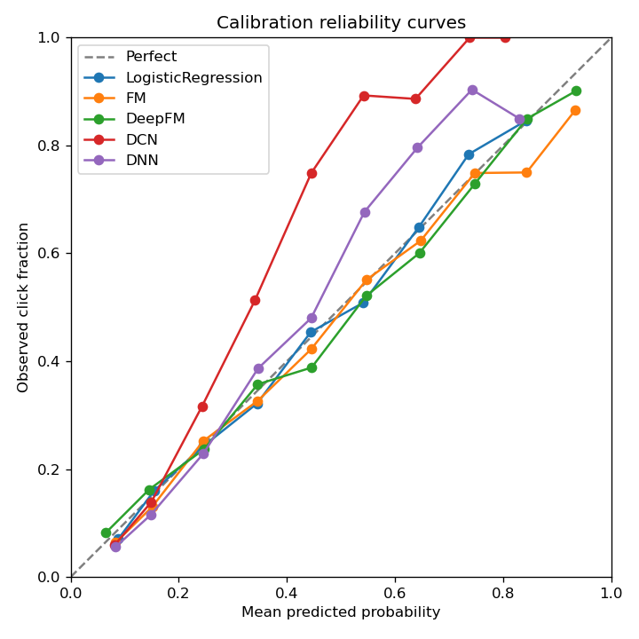

# AdRankBench Benchmark Report

This report compares click through rate models on a shared featurized dataset. Models are ranked by test AUC. All numbers come from the held out test split.

## Results

| Model | AUC | LogLoss | NE | RelaImpr | GAUC | ECE | Train s | Params |
| --- | --- | --- | --- | --- | --- | --- | --- | --- |
| DeepFM | 0.7789 | 0.4722 | 0.8141 | 0.1859 | 0.7646 | 0.0196 | 8.1916 | 21616509 |
| DCN | 0.7715 | 0.5046 | 0.8702 | 0.1298 | 0.7581 | 0.0678 | 9.5619 | 21620695 |
| DNN | 0.7708 | 0.4879 | 0.8412 | 0.1588 | 0.7571 | 0.0392 | 8.0935 | 21894881 |
| FM | 0.7419 | 0.5024 | 0.8662 | 0.1338 | 0.7246 | 0.0174 | 13.3763 | 21420028 |
| LogisticRegression | 0.6808 | 0.5365 | 0.9251 | 0.0749 | 0.6832 | 0.0102 | 0.1677 | 53 |

## Calibration

The reliability curves below overlay each model against the perfect calibration diagonal. A curve that hugs the diagonal is well calibrated.

## Feature Importance

Top logistic regression coefficients by absolute magnitude. A larger magnitude means the feature pushes the predicted click probability more strongly. The sign shows the direction of that push.

| Feature | Coefficient |
| --- | --- |
| freq_C4 | -0.8564 |
| freq_C2 | 0.6299 |
| num_0 | 0.6036 |
| num_3 | 0.3207 |
| freq_C3 | -0.3067 |
| freq_C1 | -0.1921 |
| num_15 | -0.0391 |
| num_22 | 0.0338 |
| num_9 | 0.0196 |
| num_18 | -0.0183 |
| freq_C16 | -0.0160 |
| num_10 | -0.0144 |
| freq_C19 | -0.0138 |
| freq_C15 | -0.0119 |
| num_12 | 0.0117 |

## Key Observations

The strongest model by test AUC is DeepFM. It ranks impressions better than the logistic regression baseline which scored 0.6808 AUC. Ranking quality is what an ad auction cares about most because the auction orders candidates before pricing them.

The factorization machine family beats plain logistic regression because the synthetic clicks depend on pairwise interactions between categorical fields. Logistic regression only learns linear weights on single features, so it cannot capture the lift that appears when two category groups co occur. The FM second order term and the deep towers model those interactions directly, which is why they pull ahead on AUC and normalized entropy.

Calibration and normalized entropy round out the picture. A model can rank well and still be biased in absolute probability, so the calibration curve and the expected calibration error matter for bidding and pacing. Group AUC reflects within request ranking quality, which is closer to the live auction than dataset wide AUC. Reading these metrics together gives a fair comparison of the architectures.
