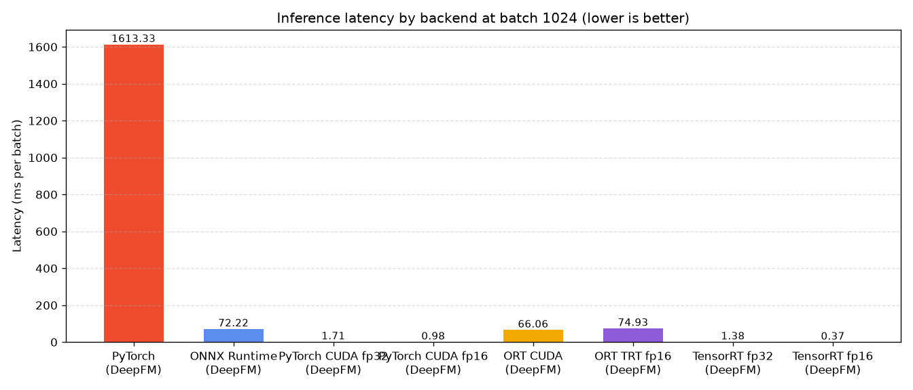
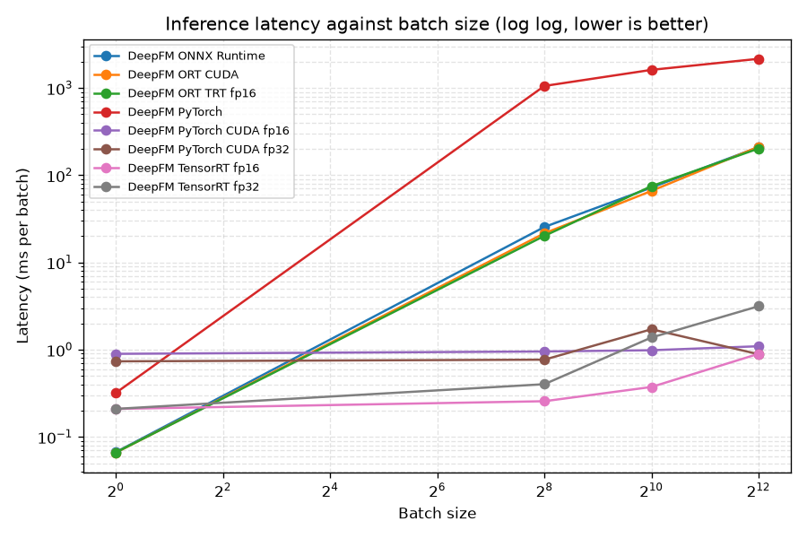
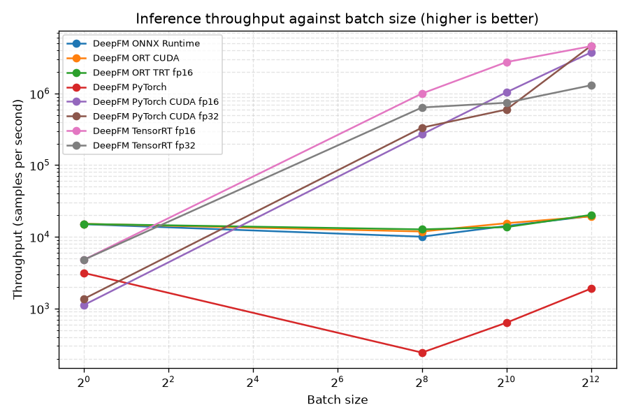
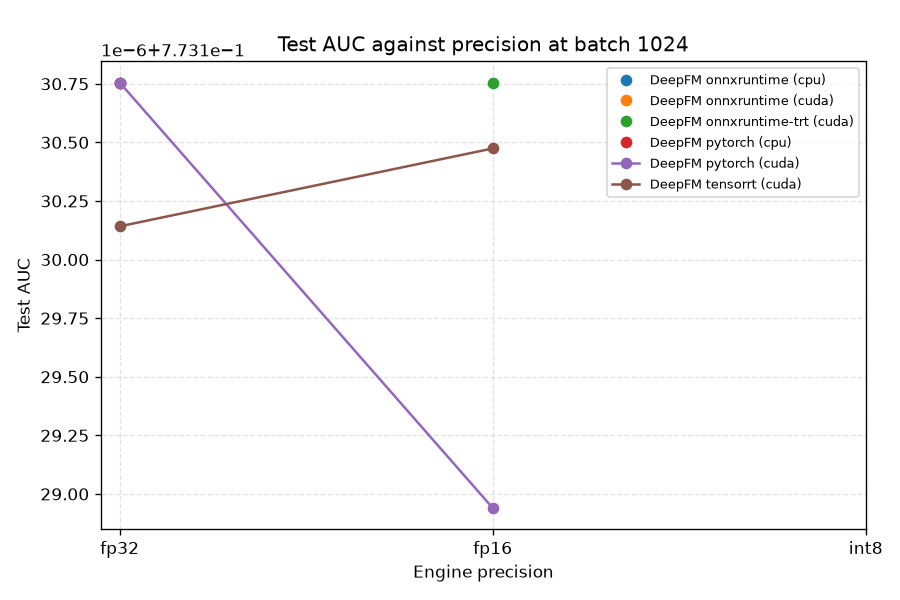

# Inference Optimization Benchmark

This report compares every serving backend this project supports, running the same trained weights on the same held out test rows. The question it answers is how much serving latency drops when a trained ranker is exported and run through an inference optimized runtime instead of raw PyTorch, and what that costs in accuracy when the runtime also drops the numeric precision.

The sweep covers DeepFM across 8 backends that ran, at the batch sizes 1, 256, 1024, 4096. It scores 10000 held out test rows per cell with seed 42, and it times 32 batches over 20 passes after 10 warmup batches.

Batch one and the largest batch are in the sweep for different reasons. Batch one is the online serving case, where a single ad request is scored on its own inside a few milliseconds and there is no other work to hide the latency behind. The largest batch is the offline scoring case, where a whole candidate pool is scored in bulk and the only number that matters is throughput. A runtime can win one of those and lose the other, so the report shows the full curve.

## Hardware and software provenance

Every number below was produced on this machine with these library versions. An inference measurement without its hardware is not a result, so this table is embedded in the markdown report and in the json artifact next to every raw measurement.

| Field | Value |
| --- | --- |
| Collected at (UTC) | 2026-08-28T05:06:54+00:00 |
| CPU | AMD EPYC 7742 64-Core Processor |
| Logical cores | 128 |
| Platform | Linux-6.8.0-59-generic-x86_64-with-glibc2.39 |
| Architecture | x86_64 |
| Python | 3.12.3 (CPython) |
| NumPy | 2.1.2 |
| PyTorch | 2.8.0+cu128 |
| PyTorch cuda build | 12.8 |
| PyTorch cuda available | True |
| ONNX Runtime | 1.29.0 |
| ONNX Runtime providers | TensorrtExecutionProvider, CUDAExecutionProvider, CPUExecutionProvider |
| OpenVINO | not available |
| TensorRT | 10.8.0.43 |
| GPU | NVIDIA A100-SXM4-80GB |
| GPU driver | 570.195.03 |
| CUDA driver runtime | 12.8 |
| GPU memory | 80.0 GB |
| GPU compute capability | 8.0 |
| GPU peak memory bandwidth (estimated) | 2039 GB/s |

## Two lanes, never blended

The cpu lane ran on AMD EPYC 7742 64-Core Processor (x86_64). It holds PyTorch eager mode, ONNX Runtime on the cpu execution provider, and OpenVINO. OpenVINO is Intel's cpu inference toolkit and it belongs to this lane only. It is not a like for like comparison against any gpu backend and it is never reported as one, because a cpu runtime and a gpu runtime answer different deployment questions and putting their numbers in the same ranking would be meaningless.

The gpu lane ran on NVIDIA A100-SXM4-80GB (driver 570.195.03). It holds PyTorch eager on cuda, ONNX Runtime on the cuda and TensorRT execution providers, and the natively built TensorRT engines. Every timing in this lane is taken with the cuda stream synchronized, so it measures completed device work rather than how fast the host filled a queue.

## Summary at batch 1024

This is the headline table. Latency is the mean wall time per batch, p50 and p99 are the median and the tail, throughput is the steady state samples per second, and AUC and LogLoss are measured over every held out test row rather than over the timing subset.

| Model | Backend | Lane | Hardware | Latency (ms/batch) | p50 (ms) | p99 (ms) | Throughput (samples/s) | AUC | LogLoss |
| --- | --- | --- | --- | --- | --- | --- | --- | --- | --- |
| DeepFM | PyTorch eager (CPU, fp32) | cpu | AMD EPYC 7742 64-Core Processor (x86_64) | 1613.330 | 1608.501 | 1901.865 | 635 | 0.7731 | 0.4796 |
| DeepFM | ONNX Runtime (CPU provider, fp32) | cpu | AMD EPYC 7742 64-Core Processor (x86_64) | 72.220 | 98.120 | 195.647 | 14,179 | 0.7731 | 0.4796 |
| DeepFM | PyTorch eager (CUDA, fp32) | gpu | NVIDIA A100-SXM4-80GB (driver 570.195.03) | 1.714 | 0.794 | 16.527 | 597,440 | 0.7731 | 0.4796 |
| DeepFM | PyTorch eager (CUDA, fp16 autocast) | gpu | NVIDIA A100-SXM4-80GB (driver 570.195.03) | 0.985 | 0.972 | 1.184 | 1,039,696 | 0.7731 | 0.4796 |
| DeepFM | ONNX Runtime (CUDA provider, fp32) | gpu | NVIDIA A100-SXM4-80GB (driver 570.195.03) | 66.060 | 93.967 | 194.923 | 15,501 | 0.7731 | 0.4796 |
| DeepFM | ONNX Runtime (TensorRT provider, fp16) | gpu | NVIDIA A100-SXM4-80GB (driver 570.195.03) | 74.935 | 98.039 | 193.915 | 13,665 | 0.7731 | 0.4796 |
| DeepFM | TensorRT native engine (fp32) | gpu | NVIDIA A100-SXM4-80GB (driver 570.195.03) | 1.380 | 0.369 | 18.987 | 742,284 | 0.7731 | 0.4796 |
| DeepFM | TensorRT native engine (fp16) | gpu | NVIDIA A100-SXM4-80GB (driver 570.195.03) | 0.374 | 0.370 | 0.451 | 2,741,162 | 0.7731 | 0.4796 |



## Backends that did not run

Each of these was asked for and could not be built. The reason is the exact one the registry reported, not a summary of it.

| Model | Backend | Lane | Reason |
| --- | --- | --- | --- |
| DeepFM | OpenVINO (CPU, fp32) | cpu | openvino is not installed (No module named 'openvino'), so this backend was skipped |
| DeepFM | ONNX Runtime (TensorRT provider, int8) | gpu | the int8 TensorRT provider needs a calibration table and none exists at results/trt/deepfm_int8_calibration.cache. Run scripts/build_trt_engines.py first so the scales are written. |
| DeepFM | TensorRT native engine (int8) | gpu | no serialized int8 engine at results/trt/deepfm_int8_bs4096.engine. Run scripts/build_trt_engines.py on this machine to build it, because an engine is tied to the gpu architecture and the TensorRT version that built it. |

## Full sweep

One row per model, backend, and batch size. Engine build time is a deploy time cost and it is reported in its own column so it is never confused with a serving number.

| Model | Backend | Precision | Lane | Batch | Rows timed per batch | Mean (ms) | p50 (ms) | p99 (ms) | Throughput (samples/s) | AUC | LogLoss | Build (s) | Peak GPU memory | Model on disk |
| --- | --- | --- | --- | --- | --- | --- | --- | --- | --- | --- | --- | --- | --- | --- |
| DeepFM | PyTorch | fp32 | cpu | 1 | 1 | 0.319 | 0.314 | 0.353 | 3,139 | 0.7731 | 0.4796 | not available | not available | 82.5 MB |
| DeepFM | PyTorch | fp32 | cpu | 256 | 256 | 1054.213 | 1092.143 | 1203.463 | 243 | 0.7731 | 0.4796 | not available | not available | 82.5 MB |
| DeepFM | PyTorch | fp32 | cpu | 1024 | 1024 | 1613.330 | 1608.501 | 1901.865 | 635 | 0.7731 | 0.4796 | not available | not available | 82.5 MB |
| DeepFM | PyTorch | fp32 | cpu | 4096 | 4096 | 2159.988 | 2149.733 | 2457.680 | 1,896 | 0.7731 | 0.4796 | not available | not available | 82.5 MB |
| DeepFM | ONNX Runtime | fp32 | cpu | 1 | 1 | 0.067 | 0.066 | 0.078 | 14,999 | 0.7731 | 0.4796 | not available | not available | 82.5 MB |
| DeepFM | ONNX Runtime | fp32 | cpu | 256 | 256 | 25.478 | 1.865 | 98.747 | 10,048 | 0.7731 | 0.4796 | not available | not available | 82.5 MB |
| DeepFM | ONNX Runtime | fp32 | cpu | 1024 | 1024 | 72.220 | 98.120 | 195.647 | 14,179 | 0.7731 | 0.4796 | not available | not available | 82.5 MB |
| DeepFM | ONNX Runtime | fp32 | cpu | 4096 | 4096 | 210.033 | 199.653 | 357.647 | 19,502 | 0.7731 | 0.4796 | not available | not available | 82.5 MB |
| DeepFM | PyTorch CUDA fp32 | fp32 | gpu | 1 | 1 | 0.735 | 0.727 | 0.921 | 1,360 | 0.7731 | 0.4796 | not available | 1.7 GB | 82.5 MB |
| DeepFM | PyTorch CUDA fp32 | fp32 | gpu | 256 | 256 | 0.768 | 0.763 | 0.862 | 333,531 | 0.7731 | 0.4796 | not available | 1.7 GB | 82.5 MB |
| DeepFM | PyTorch CUDA fp32 | fp32 | gpu | 1024 | 1024 | 1.714 | 0.794 | 16.527 | 597,440 | 0.7731 | 0.4796 | not available | 1.7 GB | 82.5 MB |
| DeepFM | PyTorch CUDA fp32 | fp32 | gpu | 4096 | 4096 | 0.886 | 0.876 | 0.957 | 4,624,540 | 0.7731 | 0.4796 | not available | 1.7 GB | 82.5 MB |
| DeepFM | PyTorch CUDA fp16 | fp16 | gpu | 1 | 1 | 0.896 | 0.891 | 1.078 | 1,117 | 0.7731 | 0.4796 | not available | 1.7 GB | 82.5 MB |
| DeepFM | PyTorch CUDA fp16 | fp16 | gpu | 256 | 256 | 0.953 | 0.943 | 1.142 | 268,654 | 0.7731 | 0.4796 | not available | 1.7 GB | 82.5 MB |
| DeepFM | PyTorch CUDA fp16 | fp16 | gpu | 1024 | 1024 | 0.985 | 0.972 | 1.184 | 1,039,696 | 0.7731 | 0.4796 | not available | 1.7 GB | 82.5 MB |
| DeepFM | PyTorch CUDA fp16 | fp16 | gpu | 4096 | 4096 | 1.094 | 1.091 | 1.286 | 3,742,726 | 0.7731 | 0.4796 | not available | 1.7 GB | 82.5 MB |
| DeepFM | ORT CUDA | fp32 | gpu | 1 | 1 | 0.066 | 0.065 | 0.075 | 15,189 | 0.7731 | 0.4796 | not available | 1.7 GB | 82.5 MB |
| DeepFM | ORT CUDA | fp32 | gpu | 256 | 256 | 21.568 | 1.744 | 98.701 | 11,869 | 0.7731 | 0.4796 | not available | 1.7 GB | 82.5 MB |
| DeepFM | ORT CUDA | fp32 | gpu | 1024 | 1024 | 66.060 | 93.967 | 194.923 | 15,501 | 0.7731 | 0.4796 | not available | 1.7 GB | 82.5 MB |
| DeepFM | ORT CUDA | fp32 | gpu | 4096 | 4096 | 212.420 | 200.791 | 300.870 | 19,283 | 0.7731 | 0.4796 | not available | 1.7 GB | 82.5 MB |
| DeepFM | ORT TRT fp16 | fp16 | gpu | 1 | 1 | 0.066 | 0.065 | 0.075 | 15,121 | 0.7731 | 0.4796 | not available | 1.7 GB | 82.5 MB |
| DeepFM | ORT TRT fp16 | fp16 | gpu | 256 | 256 | 20.144 | 1.745 | 97.481 | 12,708 | 0.7731 | 0.4796 | not available | 1.7 GB | 82.5 MB |
| DeepFM | ORT TRT fp16 | fp16 | gpu | 1024 | 1024 | 74.935 | 98.039 | 193.915 | 13,665 | 0.7731 | 0.4796 | not available | 1.7 GB | 82.5 MB |
| DeepFM | ORT TRT fp16 | fp16 | gpu | 4096 | 4096 | 202.426 | 199.022 | 359.512 | 20,235 | 0.7731 | 0.4796 | not available | 2.1 GB | 82.5 MB |
| DeepFM | TensorRT fp32 | fp32 | gpu | 1 | 1 | 0.209 | 0.206 | 0.243 | 4,778 | 0.7731 | 0.4796 | 0.0 | 1.7 GB | 82.8 MB |
| DeepFM | TensorRT fp32 | fp32 | gpu | 256 | 256 | 0.402 | 0.263 | 0.308 | 637,182 | 0.7731 | 0.4796 | 0.0 | 1.7 GB | 82.8 MB |
| DeepFM | TensorRT fp32 | fp32 | gpu | 1024 | 1024 | 1.380 | 0.369 | 18.987 | 742,284 | 0.7731 | 0.4796 | 0.0 | 1.7 GB | 82.8 MB |
| DeepFM | TensorRT fp32 | fp32 | gpu | 4096 | 4096 | 3.150 | 0.901 | 55.745 | 1,300,393 | 0.7731 | 0.4796 | 0.0 | 1.7 GB | 82.8 MB |
| DeepFM | TensorRT fp16 | fp16 | gpu | 1 | 1 | 0.209 | 0.207 | 0.236 | 4,778 | 0.7731 | 0.4796 | 0.0 | 1.7 GB | 82.8 MB |
| DeepFM | TensorRT fp16 | fp16 | gpu | 256 | 256 | 0.256 | 0.256 | 0.280 | 998,636 | 0.7731 | 0.4796 | 0.0 | 1.7 GB | 82.8 MB |
| DeepFM | TensorRT fp16 | fp16 | gpu | 1024 | 1024 | 0.374 | 0.370 | 0.451 | 2,741,162 | 0.7731 | 0.4796 | 0.0 | 1.7 GB | 82.8 MB |
| DeepFM | TensorRT fp16 | fp16 | gpu | 4096 | 4096 | 0.897 | 0.893 | 0.957 | 4,566,075 | 0.7731 | 0.4796 | 0.0 | 1.7 GB | 82.8 MB |





## Accuracy against the fp32 reference

Reduced precision is not free. An fp16 engine rounds every activation to half the mantissa and an int8 engine replaces the numbers entirely with a quantized approximation chosen by a calibrator. This table reports what that cost, measured against eager PyTorch fp32 on exactly the same test rows. The regression is reported whatever it is. Nothing here was tuned to make a lower precision engine look better.

| Model | Backend | Precision | AUC | AUC delta | LogLoss | LogLoss delta |
| --- | --- | --- | --- | --- | --- | --- |
| DeepFM | PyTorch | fp32 | 0.77313 | +0.00000 | 0.47956 | +0.00000 |
| DeepFM | ONNX Runtime | fp32 | 0.77313 | +0.00000 | 0.47956 | +0.00000 |
| DeepFM | PyTorch CUDA fp32 | fp32 | 0.77313 | +0.00000 | 0.47956 | -0.00000 |
| DeepFM | PyTorch CUDA fp16 | fp16 | 0.77313 | -0.00000 | 0.47956 | +0.00000 |
| DeepFM | ORT CUDA | fp32 | 0.77313 | +0.00000 | 0.47956 | +0.00000 |
| DeepFM | ORT TRT fp16 | fp16 | 0.77313 | +0.00000 | 0.47956 | +0.00000 |
| DeepFM | TensorRT fp32 | fp32 | 0.77313 | -0.00000 | 0.47956 | +0.00000 |
| DeepFM | TensorRT fp16 | fp16 | 0.77313 | -0.00000 | 0.47956 | +0.00000 |

The largest accuracy cost on this run belongs to PyTorch CUDA fp16 at fp16, which moved AUC by -0.00000 against the fp32 reference.



## Correctness gate

A matching AUC is a weak claim. AUC depends only on the ordering of the predictions, so a backend could shift every probability by a full percent and still report the same AUC to four decimals, which would leave the model badly calibrated while the table looked clean. Calibration is what ad pricing multiplies a bid by, so the gate here is the mean absolute difference between each backend's probabilities and the eager PyTorch fp32 probabilities on identical rows. It says how far a backend drifted rather than asserting that it did not.

| Model | Backend | Precision | Batch | Mean abs difference | Max abs difference |
| --- | --- | --- | --- | --- | --- |
| DeepFM | PyTorch | fp32 | 1024 | 0.000e+00 | 0.000e+00 |
| DeepFM | ONNX Runtime | fp32 | 1024 | 1.691e-08 | 1.187e-07 |
| DeepFM | PyTorch CUDA fp32 | fp32 | 1024 | 1.859e-08 | 1.318e-07 |
| DeepFM | PyTorch CUDA fp16 | fp16 | 1024 | 4.273e-05 | 3.310e-04 |
| DeepFM | ORT CUDA | fp32 | 1024 | 1.691e-08 | 1.187e-07 |
| DeepFM | ORT TRT fp16 | fp16 | 1024 | 1.691e-08 | 1.187e-07 |
| DeepFM | TensorRT fp32 | fp32 | 1024 | 2.742e-05 | 3.162e-04 |
| DeepFM | TensorRT fp16 | fp16 | 1024 | 3.708e-05 | 3.406e-04 |

## Power and energy

Latency says how fast. Power says what that speed costs, and across a serving fleet the second number is the one that sets the bill. Power is sampled through NVML on a background thread around the timing loop only, so the joules reported belong to a region of known work. Energy is the trapezoid integral of the sampled watt curve, and inferences per joule is the efficiency figure that compares two precisions without reference to wall clock.

| Model | Backend | Precision | Batch | Mean power (W) | Peak power (W) | Energy (J) | Inferences per joule |
| --- | --- | --- | --- | --- | --- | --- | --- |
| DeepFM | PyTorch | fp32 | 1024 | not available | not available | not available | not available |
| DeepFM | ONNX Runtime | fp32 | 1024 | not available | not available | not available | not available |
| DeepFM | PyTorch CUDA fp32 | fp32 | 1024 | 90.9 | 92.9 | 36.24 | 5,087 |
| DeepFM | PyTorch CUDA fp16 | fp16 | 1024 | 94.8 | 98.1 | 17.20 | 10,718 |
| DeepFM | ORT CUDA | fp32 | 1024 | 88.2 | 88.5 | 1101.87 | 167 |
| DeepFM | ORT TRT fp16 | fp16 | 1024 | 88.2 | 88.4 | 1269.36 | 145 |
| DeepFM | TensorRT fp32 | fp32 | 1024 | 88.8 | 89.1 | 20.90 | 8,820 |
| DeepFM | TensorRT fp16 | fp16 | 1024 | 89.1 | 89.1 | 5.40 | 34,102 |

## Is this model memory bound or compute bound

A DeepFM or a DCN is one very large embedding table followed by a very small multilayer perceptron. The multiply accumulate work in the perceptron is small, while the embedding lookup drags scattered rows out of a table tens of megabytes wide with almost no locality. If that shape dominates then the wall clock is set by memory bandwidth, a narrower multiply buys much less than the factor of two that half precision seems to promise, and int8 trades accuracy for a speedup that was never on the table. This section computes the evidence rather than asserting the conclusion, and it reports the answer the numbers give.

### DeepFM

| Batch | FLOPs per row | Bytes per row | Gather share of bytes | Arithmetic intensity | Achieved GB/s | Achieved GFLOP/s | Verdict |
| --- | --- | --- | --- | --- | --- | --- | --- |
| 1 | 394,230 | 788,892 | 0.3 percent | 0.50 | 12.0 | 6.0 | memory bound |
| 256 | 394,230 | 9,500 | 25.8 percent | 41.50 | 9.5 | 393.7 | near the ridge point |
| 1024 | 394,230 | 7,208 | 34.0 percent | 54.69 | 19.8 | 1,080.6 | near the ridge point |
| 4096 | 394,230 | 6,635 | 36.9 percent | 59.42 | 30.7 | 1,823.1 | near the ridge point |

The arithmetic intensity moves with the batch size, which is the whole story for this model. At batch 1 the perceptron weights have to cross the memory bus for a single row, so the intensity is 0.50 operations per byte and the workload is memory bound. At batch 4096 those same weights amortize over the whole batch and the intensity rises to 59.42 operations per byte, which is near the ridge point. The online serving case and the offline scoring case therefore sit on opposite sides of the roofline, and an optimization that helps one can do nothing at all for the other.

At the headline batch size of 1024 the reading is near the ridge point, because the arithmetic intensity is 54.69 operations per byte, inside the 20 to 100 operations per byte band where the ridge point of a modern gpu sits, so neither bound dominates and the answer depends on the specific part.

The cost model at that batch size in full.

| Quantity | Value |
| --- | --- |
| Batch size the counts are taken at | 1024 |
| Embedded fields per row | 36 |
| Embedding dimension | 16 |
| Embedding table parameters | 21,420,000 |
| Embedding table size at fp32 | 85.7 MB |
| Floating point operations per row | 394,230 |
| Bytes moved per row | 7,208 |
| Share of bytes that is the embedding gather | 34.0 percent |
| Arithmetic intensity | 54.69 operations per byte |
| Reference ridge point band | 20 to 100 operations per byte |
| Achieved bandwidth | 19.8 GB/s |
| Device peak bandwidth (estimated) | 2,039 GB/s |
| Bandwidth utilization | 1.0 percent |
| Verdict | near the ridge point |

On the fp16 prediction, fp16 came in 3.69 times faster than fp32. The roofline reading was inconclusive, so this ratio is reported without a prediction attached to it.

#### Where the time goes inside the engine

The TensorRT layer profiler was attached for 20 iterations at batch 1024. Attaching a profiler adds overhead and suppresses some fusion, so these milliseconds are not the latency the tables report. What the profile is for is the shape of the distribution, which is where the time goes rather than how much of it there is.

| Bucket | Time per iteration (ms) | Share |
| --- | --- | --- |
| Embedding gather and data movement | 0.0000 | 0.0 percent |
| Matrix multiply and perceptron | 0.0939 | 38.5 percent |
| Everything else | 0.1498 | 61.5 percent |

The perceptron owns 38.5 percent of the engine time against 0.0 percent for the gather. That contradicts the memory bound prediction for this model at this batch size, and the measurement is what stands. The hash bucket space this project uses keeps the embedding tables small enough that the perceptron is the larger cost, which is a real difference from a production scale DLRM with tables in the tens of gigabytes.


## Reproducing this report

```bash
python scripts/build_trt_engines.py
python scripts/run_inference_benchmark.py --models deepfm --batch-sizes 1 256 1024 4096
```

The engine builder is a separate step because a TensorRT plan is tied to the gpu architecture, the driver, and the TensorRT version that produced it, so it has to be built on the machine that will serve it. On a host with no gpu the builder prints what is missing and exits cleanly, and this benchmark then reports every gpu row as not available with the same reason.
