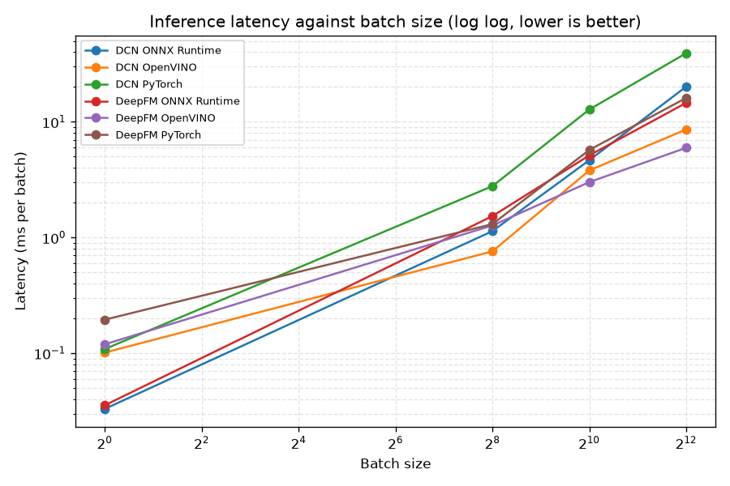
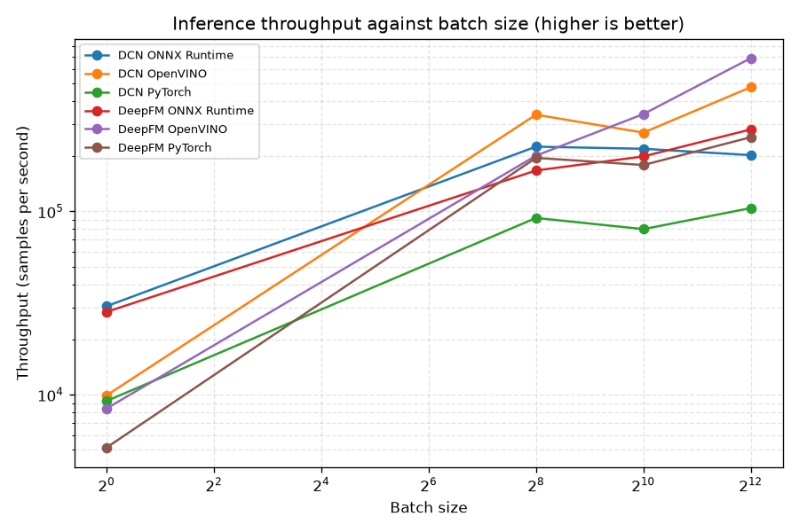
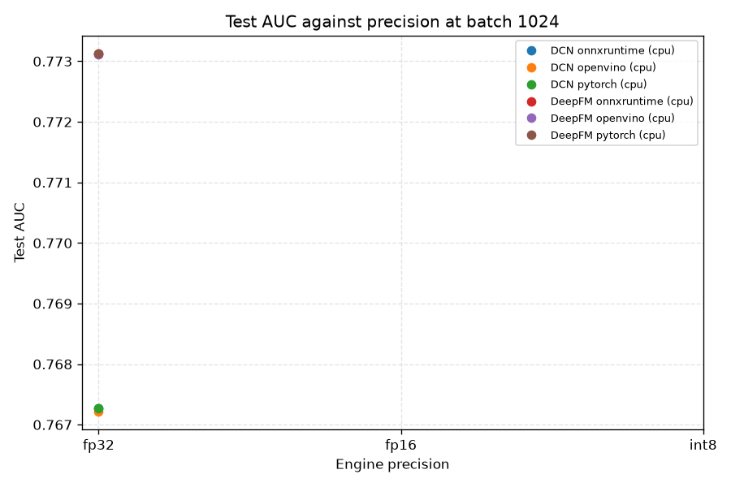

# Inference Optimization Benchmark

This report compares every serving backend this project supports, running the same trained weights on the same held out test rows. The question it answers is how much serving latency drops when a trained ranker is exported and run through an inference optimized runtime instead of raw PyTorch, and what that costs in accuracy when the runtime also drops the numeric precision.

The sweep covers DeepFM, DCN across 3 backends that ran, at the batch sizes 1, 256, 1024, 4096. It scores 10000 held out test rows per cell with seed 42, and it times 32 batches over 20 passes after 10 warmup batches.

Batch one and the largest batch are in the sweep for different reasons. Batch one is the online serving case, where a single ad request is scored on its own inside a few milliseconds and there is no other work to hide the latency behind. The largest batch is the offline scoring case, where a whole candidate pool is scored in bulk and the only number that matters is throughput. A runtime can win one of those and lose the other, so the report shows the full curve.

## Hardware and software provenance

Every number below was produced on this machine with these library versions. An inference measurement without its hardware is not a result, so this table is embedded in the markdown report and in the json artifact next to every raw measurement.

| Field | Value |
| --- | --- |
| Collected at (UTC) | 2026-08-28T02:47:48+00:00 |
| CPU | Apple M3 Pro |
| Logical cores | 12 |
| Platform | macOS-26.5.1-arm64-arm-64bit |
| Architecture | arm64 |
| Python | 3.12.7 (CPython) |
| NumPy | 2.5.2 |
| PyTorch | 2.8.0 |
| PyTorch cuda build | not available |
| PyTorch cuda available | False |
| ONNX Runtime | 1.22.0 |
| ONNX Runtime providers | CoreMLExecutionProvider, AzureExecutionProvider, CPUExecutionProvider |
| OpenVINO | 2026.2.1-21919-ede283a88e3-releases/2026/2 |
| TensorRT | not available |
| GPU | not available |
| GPU driver | not available |
| CUDA driver runtime | not available |
| GPU memory | not available |
| GPU compute capability | not available |
| GPU peak memory bandwidth (estimated) | not available |

## Two lanes, never blended

The cpu lane ran on Apple M3 Pro (arm64). It holds PyTorch eager mode, ONNX Runtime on the cpu execution provider, and OpenVINO. OpenVINO is Intel's cpu inference toolkit and it belongs to this lane only. It is not a like for like comparison against any gpu backend and it is never reported as one, because a cpu runtime and a gpu runtime answer different deployment questions and putting their numbers in the same ranking would be meaningless.

The gpu lane did not run on this host. This host is macOS, where there is no NVIDIA driver and no cuda runtime, so every gpu measurement is unavailable by construction, and the tensorrt python package is not installed (No module named 'tensorrt'). Every gpu row in every table below therefore reads not available. Nothing was estimated, extrapolated, or filled in from another machine. To fill those rows in, run this script on a cuda host after building the engines with scripts/build_trt_engines.py.

## Summary at batch 1024

This is the headline table. Latency is the mean wall time per batch, p50 and p99 are the median and the tail, throughput is the steady state samples per second, and AUC and LogLoss are measured over every held out test row rather than over the timing subset.

| Model | Backend | Lane | Hardware | Latency (ms/batch) | p50 (ms) | p99 (ms) | Throughput (samples/s) | AUC | LogLoss |
| --- | --- | --- | --- | --- | --- | --- | --- | --- | --- |
| DeepFM | PyTorch eager (CPU, fp32) | cpu | Apple M3 Pro (arm64) | 5.717 | 4.917 | 16.936 | 179,127 | 0.7731 | 0.4796 |
| DeepFM | ONNX Runtime (CPU provider, fp32) | cpu | Apple M3 Pro (arm64) | 5.132 | 4.627 | 9.449 | 199,532 | 0.7731 | 0.4796 |
| DeepFM | OpenVINO (CPU, fp32) | cpu | Apple M3 Pro (arm64) | 3.014 | 2.910 | 5.981 | 339,761 | 0.7731 | 0.4796 |
| DCN | PyTorch eager (CPU, fp32) | cpu | Apple M3 Pro (arm64) | 12.792 | 12.034 | 29.240 | 80,047 | 0.7673 | 0.5034 |
| DCN | ONNX Runtime (CPU provider, fp32) | cpu | Apple M3 Pro (arm64) | 4.661 | 4.130 | 10.801 | 219,708 | 0.7673 | 0.5034 |
| DCN | OpenVINO (CPU, fp32) | cpu | Apple M3 Pro (arm64) | 3.804 | 3.011 | 12.334 | 269,172 | 0.7672 | 0.5034 |


## Backends that did not run

Each of these was asked for and could not be built. The reason is the exact one the registry reported, not a summary of it.

| Model | Backend | Lane | Reason |
| --- | --- | --- | --- |
| DeepFM | PyTorch eager (CUDA, fp32) | gpu | torch reports no cuda device on this host, so every gpu lane is unavailable |
| DeepFM | PyTorch eager (CUDA, fp16 autocast) | gpu | torch reports no cuda device on this host, so every gpu lane is unavailable |
| DeepFM | ONNX Runtime (CUDA provider, fp32) | gpu | this ONNX Runtime build has no CUDAExecutionProvider, it offers ['CoreMLExecutionProvider', 'AzureExecutionProvider', 'CPUExecutionProvider']. Install onnxruntime-gpu on a cuda host. |
| DeepFM | ONNX Runtime (TensorRT provider, fp16) | gpu | this ONNX Runtime build has no TensorrtExecutionProvider, it offers ['CoreMLExecutionProvider', 'AzureExecutionProvider', 'CPUExecutionProvider']. Install onnxruntime-gpu built against TensorRT on a cuda host. |
| DeepFM | ONNX Runtime (TensorRT provider, int8) | gpu | this ONNX Runtime build has no TensorrtExecutionProvider, it offers ['CoreMLExecutionProvider', 'AzureExecutionProvider', 'CPUExecutionProvider']. Install onnxruntime-gpu built against TensorRT on a cuda host. |
| DeepFM | TensorRT native engine (fp32) | gpu | torch reports no cuda device on this host, so every gpu lane is unavailable |
| DeepFM | TensorRT native engine (fp16) | gpu | torch reports no cuda device on this host, so every gpu lane is unavailable |
| DeepFM | TensorRT native engine (int8) | gpu | torch reports no cuda device on this host, so every gpu lane is unavailable |
| DCN | PyTorch eager (CUDA, fp32) | gpu | torch reports no cuda device on this host, so every gpu lane is unavailable |
| DCN | PyTorch eager (CUDA, fp16 autocast) | gpu | torch reports no cuda device on this host, so every gpu lane is unavailable |
| DCN | ONNX Runtime (CUDA provider, fp32) | gpu | this ONNX Runtime build has no CUDAExecutionProvider, it offers ['CoreMLExecutionProvider', 'AzureExecutionProvider', 'CPUExecutionProvider']. Install onnxruntime-gpu on a cuda host. |
| DCN | ONNX Runtime (TensorRT provider, fp16) | gpu | this ONNX Runtime build has no TensorrtExecutionProvider, it offers ['CoreMLExecutionProvider', 'AzureExecutionProvider', 'CPUExecutionProvider']. Install onnxruntime-gpu built against TensorRT on a cuda host. |
| DCN | ONNX Runtime (TensorRT provider, int8) | gpu | this ONNX Runtime build has no TensorrtExecutionProvider, it offers ['CoreMLExecutionProvider', 'AzureExecutionProvider', 'CPUExecutionProvider']. Install onnxruntime-gpu built against TensorRT on a cuda host. |
| DCN | TensorRT native engine (fp32) | gpu | torch reports no cuda device on this host, so every gpu lane is unavailable |
| DCN | TensorRT native engine (fp16) | gpu | torch reports no cuda device on this host, so every gpu lane is unavailable |
| DCN | TensorRT native engine (int8) | gpu | torch reports no cuda device on this host, so every gpu lane is unavailable |

## Full sweep

One row per model, backend, and batch size. Engine build time is a deploy time cost and it is reported in its own column so it is never confused with a serving number.

| Model | Backend | Precision | Lane | Batch | Rows timed per batch | Mean (ms) | p50 (ms) | p99 (ms) | Throughput (samples/s) | AUC | LogLoss | Build (s) | Peak GPU memory | Model on disk |
| --- | --- | --- | --- | --- | --- | --- | --- | --- | --- | --- | --- | --- | --- | --- |
| DCN | PyTorch | fp32 | cpu | 1 | 1 | 0.108 | 0.101 | 0.224 | 9,228 | 0.7673 | 0.5034 | not available | not available | 82.5 MB |
| DCN | PyTorch | fp32 | cpu | 256 | 256 | 2.779 | 2.514 | 6.120 | 92,117 | 0.7673 | 0.5034 | not available | not available | 82.5 MB |
| DCN | PyTorch | fp32 | cpu | 1024 | 1024 | 12.792 | 12.034 | 29.240 | 80,047 | 0.7673 | 0.5034 | not available | not available | 82.5 MB |
| DCN | PyTorch | fp32 | cpu | 4096 | 4096 | 39.283 | 36.930 | 72.371 | 104,269 | 0.7673 | 0.5034 | not available | not available | 82.5 MB |
| DCN | ONNX Runtime | fp32 | cpu | 1 | 1 | 0.033 | 0.032 | 0.045 | 30,367 | 0.7673 | 0.5034 | not available | not available | 82.5 MB |
| DCN | ONNX Runtime | fp32 | cpu | 256 | 256 | 1.135 | 1.010 | 3.027 | 225,641 | 0.7673 | 0.5034 | not available | not available | 82.5 MB |
| DCN | ONNX Runtime | fp32 | cpu | 1024 | 1024 | 4.661 | 4.130 | 10.801 | 219,708 | 0.7673 | 0.5034 | not available | not available | 82.5 MB |
| DCN | ONNX Runtime | fp32 | cpu | 4096 | 4096 | 20.195 | 18.112 | 39.530 | 202,819 | 0.7673 | 0.5034 | not available | not available | 82.5 MB |
| DCN | OpenVINO | fp32 | cpu | 1 | 1 | 0.101 | 0.091 | 0.315 | 9,891 | 0.7672 | 0.5034 | not available | not available | 82.5 MB |
| DCN | OpenVINO | fp32 | cpu | 256 | 256 | 0.759 | 0.714 | 1.588 | 337,191 | 0.7672 | 0.5034 | not available | not available | 82.5 MB |
| DCN | OpenVINO | fp32 | cpu | 1024 | 1024 | 3.804 | 3.011 | 12.334 | 269,172 | 0.7672 | 0.5034 | not available | not available | 82.5 MB |
| DCN | OpenVINO | fp32 | cpu | 4096 | 4096 | 8.600 | 8.386 | 14.144 | 476,273 | 0.7672 | 0.5034 | not available | not available | 82.5 MB |
| DeepFM | PyTorch | fp32 | cpu | 1 | 1 | 0.195 | 0.116 | 0.800 | 5,137 | 0.7731 | 0.4796 | not available | not available | 82.5 MB |
| DeepFM | PyTorch | fp32 | cpu | 256 | 256 | 1.306 | 1.117 | 3.739 | 196,048 | 0.7731 | 0.4796 | not available | not available | 82.5 MB |
| DeepFM | PyTorch | fp32 | cpu | 1024 | 1024 | 5.717 | 4.917 | 16.936 | 179,127 | 0.7731 | 0.4796 | not available | not available | 82.5 MB |
| DeepFM | PyTorch | fp32 | cpu | 4096 | 4096 | 16.121 | 15.438 | 36.097 | 254,081 | 0.7731 | 0.4796 | not available | not available | 82.5 MB |
| DeepFM | ONNX Runtime | fp32 | cpu | 1 | 1 | 0.035 | 0.032 | 0.109 | 28,275 | 0.7731 | 0.4796 | not available | not available | 82.5 MB |
| DeepFM | ONNX Runtime | fp32 | cpu | 256 | 256 | 1.531 | 1.078 | 7.890 | 167,254 | 0.7731 | 0.4796 | not available | not available | 82.5 MB |
| DeepFM | ONNX Runtime | fp32 | cpu | 1024 | 1024 | 5.132 | 4.627 | 9.449 | 199,532 | 0.7731 | 0.4796 | not available | not available | 82.5 MB |
| DeepFM | ONNX Runtime | fp32 | cpu | 4096 | 4096 | 14.615 | 14.324 | 19.613 | 280,266 | 0.7731 | 0.4796 | not available | not available | 82.5 MB |
| DeepFM | OpenVINO | fp32 | cpu | 1 | 1 | 0.119 | 0.106 | 0.346 | 8,392 | 0.7731 | 0.4796 | not available | not available | 82.5 MB |
| DeepFM | OpenVINO | fp32 | cpu | 256 | 256 | 1.271 | 1.200 | 2.607 | 201,485 | 0.7731 | 0.4796 | not available | not available | 82.5 MB |
| DeepFM | OpenVINO | fp32 | cpu | 1024 | 1024 | 3.014 | 2.910 | 5.981 | 339,761 | 0.7731 | 0.4796 | not available | not available | 82.5 MB |
| DeepFM | OpenVINO | fp32 | cpu | 4096 | 4096 | 5.968 | 5.405 | 8.561 | 686,271 | 0.7731 | 0.4796 | not available | not available | 82.5 MB |





## Accuracy against the fp32 reference

Reduced precision is not free. An fp16 engine rounds every activation to half the mantissa and an int8 engine replaces the numbers entirely with a quantized approximation chosen by a calibrator. This table reports what that cost, measured against eager PyTorch fp32 on exactly the same test rows. The regression is reported whatever it is. Nothing here was tuned to make a lower precision engine look better.

| Model | Backend | Precision | AUC | AUC delta | LogLoss | LogLoss delta |
| --- | --- | --- | --- | --- | --- | --- |
| DeepFM | PyTorch | fp32 | 0.77313 | +0.00000 | 0.47956 | +0.00000 |
| DeepFM | ONNX Runtime | fp32 | 0.77313 | +0.00000 | 0.47956 | -0.00000 |
| DeepFM | OpenVINO | fp32 | 0.77311 | -0.00002 | 0.47958 | +0.00002 |
| DCN | PyTorch | fp32 | 0.76727 | +0.00000 | 0.50340 | +0.00000 |
| DCN | ONNX Runtime | fp32 | 0.76727 | -0.00000 | 0.50340 | +0.00000 |
| DCN | OpenVINO | fp32 | 0.76722 | -0.00006 | 0.50341 | +0.00002 |

No reduced precision engine ran on this host, so there is no precision cost to report. Every row above is fp32, which means the deltas that are not exactly zero are floating point noise between runtimes rather than a quantization loss. The fp16 and int8 rows are not available for the reason given in the backends that did not run table.



## Correctness gate

A matching AUC is a weak claim. AUC depends only on the ordering of the predictions, so a backend could shift every probability by a full percent and still report the same AUC to four decimals, which would leave the model badly calibrated while the table looked clean. Calibration is what ad pricing multiplies a bid by, so the gate here is the mean absolute difference between each backend's probabilities and the eager PyTorch fp32 probabilities on identical rows. It says how far a backend drifted rather than asserting that it did not.

| Model | Backend | Precision | Batch | Mean abs difference | Max abs difference |
| --- | --- | --- | --- | --- | --- |
| DeepFM | PyTorch | fp32 | 1024 | 0.000e+00 | 0.000e+00 |
| DeepFM | ONNX Runtime | fp32 | 1024 | 1.654e-08 | 1.325e-07 |
| DeepFM | OpenVINO | fp32 | 1024 | 1.455e-04 | 1.124e-03 |
| DCN | PyTorch | fp32 | 1024 | 0.000e+00 | 0.000e+00 |
| DCN | ONNX Runtime | fp32 | 1024 | 1.992e-08 | 1.095e-07 |
| DCN | OpenVINO | fp32 | 1024 | 3.092e-04 | 1.694e-03 |

## Power and energy

Latency says how fast. Power says what that speed costs, and across a serving fleet the second number is the one that sets the bill. Power is sampled through NVML on a background thread around the timing loop only, so the joules reported belong to a region of known work. Energy is the trapezoid integral of the sampled watt curve, and inferences per joule is the efficiency figure that compares two precisions without reference to wall clock.

| Model | Backend | Precision | Batch | Mean power (W) | Peak power (W) | Energy (J) | Inferences per joule |
| --- | --- | --- | --- | --- | --- | --- | --- |
| DeepFM | PyTorch | fp32 | 1024 | not available | not available | not available | not available |
| DeepFM | ONNX Runtime | fp32 | 1024 | not available | not available | not available | not available |
| DeepFM | OpenVINO | fp32 | 1024 | not available | not available | not available | not available |
| DCN | PyTorch | fp32 | 1024 | not available | not available | not available | not available |
| DCN | ONNX Runtime | fp32 | 1024 | not available | not available | not available | not available |
| DCN | OpenVINO | fp32 | 1024 | not available | not available | not available | not available |

Every cell in this table reads not available on this run. NVML reports gpu power and there is no gpu on this host, so no watt was ever measured. A cpu power figure is not substituted in, because a package power reading taken from a different sensor on a different device is not the same measurement and presenting it here would invite exactly the comparison this report refuses to make.

## Is this model memory bound or compute bound

A DeepFM or a DCN is one very large embedding table followed by a very small multilayer perceptron. The multiply accumulate work in the perceptron is small, while the embedding lookup drags scattered rows out of a table tens of megabytes wide with almost no locality. If that shape dominates then the wall clock is set by memory bandwidth, a narrower multiply buys much less than the factor of two that half precision seems to promise, and int8 trades accuracy for a speedup that was never on the table. This section computes the evidence rather than asserting the conclusion, and it reports the answer the numbers give.

### DeepFM

| Batch | FLOPs per row | Bytes per row | Gather share of bytes | Arithmetic intensity | Achieved GB/s | Achieved GFLOP/s | Verdict |
| --- | --- | --- | --- | --- | --- | --- | --- |
| 1 | 394,230 | 788,892 | 0.3 percent | 0.50 | 22.3 | 11.1 | memory bound |
| 256 | 394,230 | 9,500 | 25.8 percent | 41.50 | 1.9 | 79.4 | near the ridge point |
| 1024 | 394,230 | 7,208 | 34.0 percent | 54.69 | 2.4 | 133.9 | near the ridge point |
| 4096 | 394,230 | 6,635 | 36.9 percent | 59.42 | 4.6 | 270.5 | near the ridge point |

The arithmetic intensity moves with the batch size, which is the whole story for this model. At batch 1 the perceptron weights have to cross the memory bus for a single row, so the intensity is 0.50 operations per byte and the workload is memory bound. At batch 4096 those same weights amortize over the whole batch and the intensity rises to 59.42 operations per byte, which is near the ridge point. The online serving case and the offline scoring case therefore sit on opposite sides of the roofline, and an optimization that helps one can do nothing at all for the other.

At the headline batch size of 1024 the reading is near the ridge point, because the arithmetic intensity is 54.69 operations per byte, inside the 20 to 100 operations per byte band where the ridge point of a modern gpu sits, so neither bound dominates and the answer depends on the specific part.

The cost model at that batch size in full.

| Quantity | Value |
| --- | --- |
| Batch size the counts are taken at | 1024 |
| Embedded fields per row | 36 |
| Embedding dimension | 16 |
| Embedding table parameters | 21,420,000 |
| Embedding table size at fp32 | 85.7 MB |
| Floating point operations per row | 394,230 |
| Bytes moved per row | 7,208 |
| Share of bytes that is the embedding gather | 34.0 percent |
| Arithmetic intensity | 54.69 operations per byte |
| Reference ridge point band | 20 to 100 operations per byte |
| Achieved bandwidth | not available GB/s |
| Device peak bandwidth (estimated) | not available GB/s |
| Bandwidth utilization | not available percent |
| Verdict | near the ridge point |

On the fp16 prediction, the fp16 speedup could not be measured on this run, so the prediction was neither confirmed nor contradicted.

#### Where the time goes inside the engine

No per layer profile was taken on this run. No native TensorRT engine ran on this host, so there is no per layer time breakdown to report. The arithmetic intensity above is computed from the module definition and does not need a gpu, so it stands on its own, but the measured split between gather time and perceptron time needs a TensorRT engine and is not available here.

### DCN

| Batch | FLOPs per row | Bytes per row | Gather share of bytes | Arithmetic intensity | Achieved GB/s | Achieved GFLOP/s | Verdict |
| --- | --- | --- | --- | --- | --- | --- | --- |
| 1 | 395,381 | 791,184 | 0.3 percent | 0.50 | 24.0 | 12.0 | memory bound |
| 256 | 395,381 | 9,501 | 25.8 percent | 41.61 | 3.2 | 133.3 | near the ridge point |
| 1024 | 395,381 | 7,202 | 34.0 percent | 54.90 | 1.9 | 106.4 | near the ridge point |
| 4096 | 395,381 | 6,628 | 36.9 percent | 59.66 | 3.2 | 188.3 | near the ridge point |

The arithmetic intensity moves with the batch size, which is the whole story for this model. At batch 1 the perceptron weights have to cross the memory bus for a single row, so the intensity is 0.50 operations per byte and the workload is memory bound. At batch 4096 those same weights amortize over the whole batch and the intensity rises to 59.66 operations per byte, which is near the ridge point. The online serving case and the offline scoring case therefore sit on opposite sides of the roofline, and an optimization that helps one can do nothing at all for the other.

At the headline batch size of 1024 the reading is near the ridge point, because the arithmetic intensity is 54.90 operations per byte, inside the 20 to 100 operations per byte band where the ridge point of a modern gpu sits, so neither bound dominates and the answer depends on the specific part.

The cost model at that batch size in full.

| Quantity | Value |
| --- | --- |
| Batch size the counts are taken at | 1024 |
| Embedded fields per row | 36 |
| Embedding dimension | 16 |
| Embedding table parameters | 21,420,000 |
| Embedding table size at fp32 | 85.7 MB |
| Floating point operations per row | 395,381 |
| Bytes moved per row | 7,202 |
| Share of bytes that is the embedding gather | 34.0 percent |
| Arithmetic intensity | 54.90 operations per byte |
| Reference ridge point band | 20 to 100 operations per byte |
| Achieved bandwidth | not available GB/s |
| Device peak bandwidth (estimated) | not available GB/s |
| Bandwidth utilization | not available percent |
| Verdict | near the ridge point |

On the fp16 prediction, the fp16 speedup could not be measured on this run, so the prediction was neither confirmed nor contradicted.

#### Where the time goes inside the engine

No per layer profile was taken on this run. No native TensorRT engine ran on this host, so there is no per layer time breakdown to report. The arithmetic intensity above is computed from the module definition and does not need a gpu, so it stands on its own, but the measured split between gather time and perceptron time needs a TensorRT engine and is not available here.

One caveat applies to this whole section on this run. The achieved bandwidth and the achieved arithmetic throughput columns are filled from the fastest backend that ran, which on this host is a cpu backend, so they are not compared against a gpu peak and the bandwidth utilization is not available. The arithmetic intensity and the ridge point comparison are properties of the model and are correct regardless of which device ran.


## Reproducing this report

```bash
python scripts/build_trt_engines.py
python scripts/run_inference_benchmark.py --models deepfm dcn --batch-sizes 1 256 1024 4096
```

The engine builder is a separate step because a TensorRT plan is tied to the gpu architecture, the driver, and the TensorRT version that produced it, so it has to be built on the machine that will serve it. On a host with no gpu the builder prints what is missing and exits cleanly, and this benchmark then reports every gpu row as not available with the same reason.
