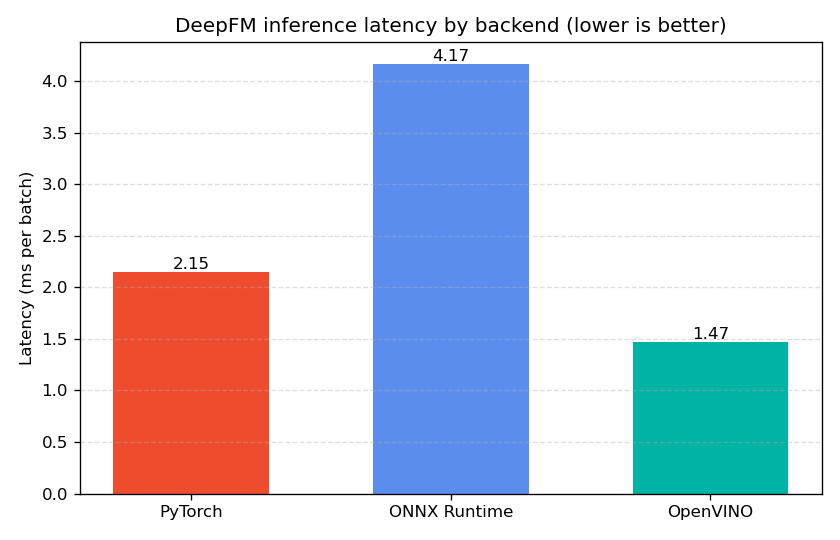

# Inference Optimization Benchmark

This report compares three serving backends running the same trained DeepFM model on the same test rows. The goal is to measure how much serving latency drops when the model is exported and run through an optimized inference runtime instead of raw PyTorch, with no change to the weights and no retraining.

All three backends run on the cpu so the hardware target is identical. The numbers come from 10000 held out test rows scored in batches of 1024, timed over 20 passes with seed 42. The AUC column is a correctness check. Because every backend runs the same weights on the same rows, the AUC values agree to within floating point noise, which confirms the exported graph and the optimized runtimes preserve the model output.

| Backend | Latency (ms/batch) | p99 (ms) | Throughput (samples/s) | AUC |
| --- | --- | --- | --- | --- |
| PyTorch | 2.154 | 3.031 | 464293 | 0.7827 |
| ONNX Runtime | 4.168 | 18.477 | 239909 | 0.7827 |
| OpenVINO | 1.467 | 2.067 | 681526 | 0.7827 |

On this run ONNX Runtime runs about 1.94 times slower per batch than PyTorch on this hardware and OpenVINO runs about 1.47 times faster per batch than PyTorch. Both optimized runtimes graph compile the network and fuse operations ahead of time, which strips Python and eager mode overhead from the hot path and lowers latency with no loss in AUC. OpenVINO is Intel's inference toolkit and tends to win on Intel CPUs, while ONNX Runtime is the open standard runtime that also ships an OpenVINO execution provider. This export and optimize step is what moves a trained ranker from an offline benchmark onto a low latency serving path.
