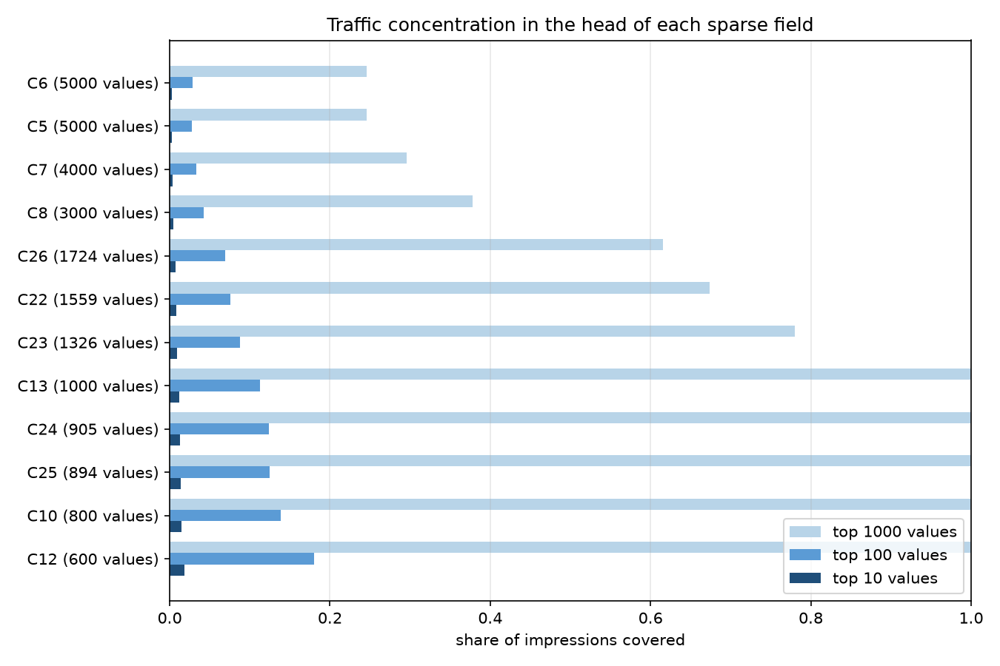
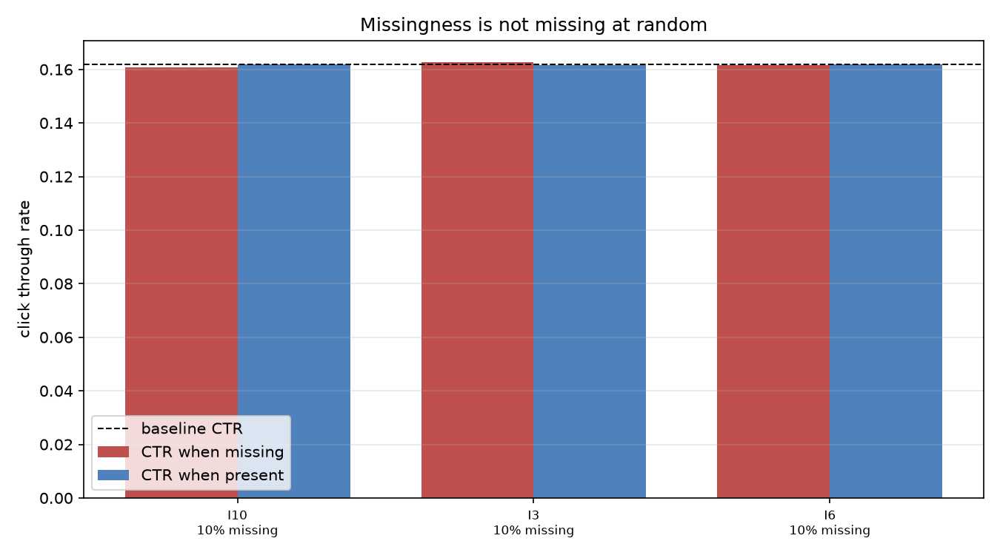
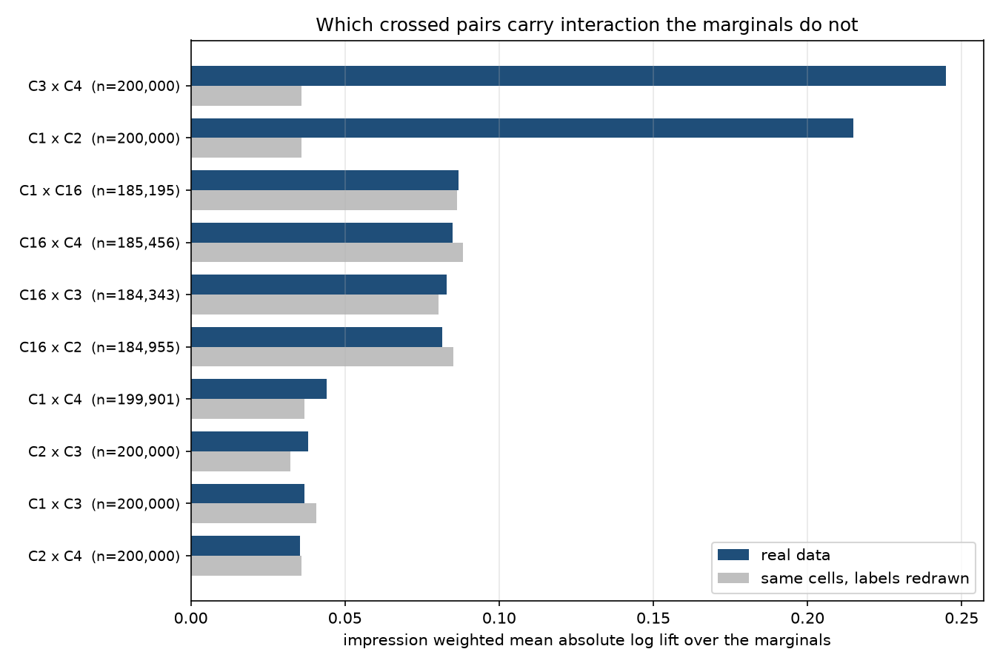
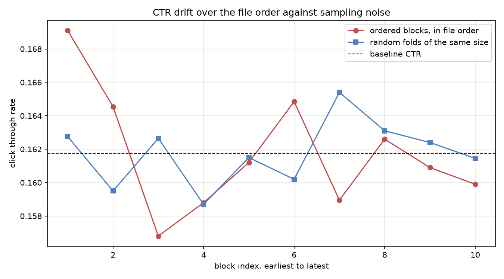

# Data Insights

Every figure in this report was produced by a SQL query in `src/sql/`, executed by DuckDB against the dataset named below, and nothing here is carried over from another run. Sample sizes sit next to the numbers because a rate without its volume is not a measurement.

- Source. synthetic generator.
- Rows analysed. 200,000.
- Baseline CTR. 0.1618 over 200,000 impressions, 32,353 clicks.
- Temporal split. train 160,000, val 20,000, test 20,000.
- Hardware. Darwin arm64, 12 logical cores, Python 3.12.7, DuckDB 1.5.5.
- Machine state. one minute load average 66.4 against 12 cores, contended.
- Total query wall time. 5.46 s.

The through line is that each feature engineering choice AdRankBench already makes is stated here as a measurement rather than a convention. Where a measurement fails to support the choice, that is said plainly.

## Long Tail Cardinality, or Why Hashing

One hot encoding a sparse field costs one column per distinct value, and an embedding table costs one row. Both are only sane when the distinct value count is small and the values recur often enough to learn from. The table below is the measurement of whether that holds. `values for 90 pct` is the number of distinct values, ranked by volume, needed to cover 90 percent of impressions, so the gap between it and the distinct value count is the size of the untrainable tail. `rare traffic` is the share of impressions whose value falls below the pipeline's rare token cutoff of 10 occurrences.

| Field | Distinct values | Top 10 cover | Top 100 cover | Values for 90 pct | Values seen once | Rare traffic |
| --- | --- | --- | --- | --- | --- | --- |
| C6 | 5,000 | 0.3% | 2.8% | 4,336 | 0 | 0.00% |
| C5 | 5,000 | 0.3% | 2.8% | 4,336 | 0 | 0.00% |
| C7 | 4,000 | 0.4% | 3.4% | 3,486 | 0 | 0.00% |
| C8 | 3,000 | 0.5% | 4.3% | 2,627 | 0 | 0.00% |
| C26 | 1,724 | 0.7% | 6.9% | 1,522 | 0 | 0.00% |
| C22 | 1,559 | 0.8% | 7.5% | 1,378 | 0 | 0.00% |
| C23 | 1,326 | 0.9% | 8.7% | 1,173 | 0 | 0.00% |
| C13 | 1,000 | 1.2% | 11.3% | 886 | 0 | 0.00% |
| C24 | 905 | 1.3% | 12.4% | 803 | 0 | 0.00% |
| C25 | 894 | 1.3% | 12.5% | 794 | 0 | 0.00% |
| C10 | 800 | 1.5% | 13.8% | 711 | 0 | 0.00% |
| C12 | 600 | 1.9% | 18.0% | 534 | 0 | 0.00% |
| C9 | 500 | 2.3% | 21.4% | 446 | 0 | 0.00% |
| C14 | 400 | 2.8% | 26.3% | 357 | 0 | 0.00% |
| C11 | 300 | 3.6% | 34.6% | 268 | 0 | 0.00% |

The widest field is C6 with 5,000 distinct values over 200,000 impressions, of which 0 were seen exactly once. Its top 100 values cover 2.8% of traffic, and it takes 4,336 distinct values to reach 90 percent. A one hot encoding of this one field would be 192 times wider than the entire dense feature block, and almost every column in it would be zero on almost every row. Across all 26 sparse fields the total distinct value count is 27,800, against the 260,000 hash buckets in total, 10,000 per field, the pipeline actually allocates. The collisions that bounded space accepts fall overwhelmingly on tail values that could not have been learned separately anyway.



## Missingness, or Why the is_missing Indicators

The dense pipeline fills missing values with zero and appends a binary indicator per column, which doubles the dense width from 13 to 26. That is only worth the width if missingness predicts the click. If a column is missing at random with respect to the label, its indicator is noise. The z statistic below is a two proportion test using the pooled rate under the null, so it says how far the gap is from what the volume alone would produce.

| Field | Rows missing | Rows present | Missing rate | CTR missing | CTR present | Delta | z |
| --- | --- | --- | --- | --- | --- | --- | --- |
| I10 | 20,002 | 179,998 | 10.0% | 0.1606 | 0.1619 | -0.0013 | -0.5 |
| I3 | 19,955 | 180,045 | 10.0% | 0.1627 | 0.1617 | +0.0011 | +0.4 |
| I6 | 20,202 | 179,798 | 10.1% | 0.1616 | 0.1618 | -0.0002 | -0.1 |
| I5 | 0 | 200,000 | 0.0% | n/a | 0.1618 | n/a | n/a |
| I11 | 0 | 200,000 | 0.0% | n/a | 0.1618 | n/a | n/a |
| I12 | 0 | 200,000 | 0.0% | n/a | 0.1618 | n/a | n/a |
| I2 | 0 | 200,000 | 0.0% | n/a | 0.1618 | n/a | n/a |
| I9 | 0 | 200,000 | 0.0% | n/a | 0.1618 | n/a | n/a |
| I4 | 0 | 200,000 | 0.0% | n/a | 0.1618 | n/a | n/a |
| I7 | 0 | 200,000 | 0.0% | n/a | 0.1618 | n/a | n/a |
| I1 | 0 | 200,000 | 0.0% | n/a | 0.1618 | n/a | n/a |
| I13 | 0 | 200,000 | 0.0% | n/a | 0.1618 | n/a | n/a |
| I8 | 0 | 200,000 | 0.0% | n/a | 0.1618 | n/a | n/a |

3 of the 13 dense columns carry missing values in this sample, and 0 of those show a CTR gap with an absolute z above 3. The largest gap is on I10, where the 20,002 rows with the value missing click at 0.1606 against 0.1619 on the 179,998 rows where it is present, a gap of -0.0013 at z = -0.5.

No column clears that bar on this sample, so this data does not make the case for the indicator block. That is the expected result here and it is worth stating rather than glossing. The synthetic generator injects missingness independently of the latent logit, so its missingness is missing at random by construction and there is no signal in it to find. The real Criteo file is where this measurement carries weight, since several of its dense columns are missing in more than 70 percent of rows and that missingness is a property of the impression rather than a coin flip. Rerun this against `data/criteo.csv` to get the number that decides it.



## Interaction Lift, or Why the Crosses

The cross generator ranks sparse fields by the variance of their training value frequency distribution and crosses the top 5 pairwise. On this data that rule selects C1, C16, C2, C3, C4. The question this section answers is whether those pairs actually carry interaction, or whether the ranking rule is picking fields for a reason unrelated to the label.

The null model is multiplicative in the lift. If value a lifts CTR by 1.3 and value b lifts it by 0.8, then with no interaction the joint cell should sit at 1.04 times baseline. The score is the impression weighted mean absolute log ratio between the observed cell CTR and that prediction, over cells with at least 100 impressions.

Every pair is measured twice. Once on the real data, and once on a null twin holding the same two value columns, and therefore the same cells at the same volumes, with the label redrawn at the baseline rate. The twin has no interaction in it by construction, so its score is what this statistic returns from sampling noise alone at these cell sizes. That is what the real numbers have to be read against.

| Pair | Cells | Impressions | Real | Null twin | Real over null | Traffic beyond 1.5x |
| --- | --- | --- | --- | --- | --- | --- |
| C3 x C4 | 144 | 200,000 | 0.2448 | 0.0360 | 6.81x | 18.5% |
| C1 x C2 | 144 | 200,000 | 0.2148 | 0.0360 | 5.97x | 14.3% |
| C1 x C4 | 143 | 199,901 | 0.0441 | 0.0368 | 1.20x | 0.2% |
| C2 x C3 | 144 | 200,000 | 0.0380 | 0.0322 | 1.18x | 0.2% |
| C16 x C3 | 534 | 184,343 | 0.0829 | 0.0804 | 1.03x | 0.7% |
| C1 x C16 | 544 | 185,195 | 0.0869 | 0.0863 | 1.01x | 0.6% |
| C2 x C4 | 144 | 200,000 | 0.0354 | 0.0358 | 0.99x | 0.0% |
| C16 x C4 | 545 | 185,456 | 0.0848 | 0.0882 | 0.96x | 0.9% |
| C16 x C2 | 539 | 184,955 | 0.0816 | 0.0851 | 0.96x | 0.7% |
| C1 x C3 | 144 | 200,000 | 0.0368 | 0.0408 | 0.90x | 0.0% |

2 of the 10 pairs beat their own null twin by 1.5 times or more, which is the reading that matters, since a pair judged against noise at its own cell sizes is the only fair test. The strongest is C3 x C4 at 6.8 times its null over 200,000 impressions in 144 cells. Those pairs are encoding something the two marginals do not already carry, which is the justification for spending bucket space on a cross.

The other side of that result is worth stating plainly. 8 pairs sit within 1.2 times their null twin, which is C1 x C4, C2 x C3, C16 x C3, C1 x C16, C2 x C4, C16 x C4, C16 x C2, C1 x C3. Their apparent lift is what this statistic returns from sampling noise alone, and they are paying for a 100,000 bucket embedding table to encode nothing. On this data the top k rule crosses more pairs than the measurement supports, and a rule that ranked pairs by lift over their null would keep the same signal at a fraction of the parameter cost.

The frequency variance rule that selects these fields never looks at the label, so this is not circular. It selects fields whose value distributions are concentrated, and concentration is what makes joint cells dense enough for an interaction to be measurable at all. The high cardinality fields the rule passes over would not produce a single cell above the volume floor at this sample size, which is a second and independent reason not to cross them.

The individual cells driving that, each with its impression count.

| Pair | Value a | Value b | Impressions | Observed CTR | Expected from marginals | Lift |
| --- | --- | --- | --- | --- | --- | --- |
| C3 x C4 | 00000009 | 0000000b | 123 | 0.1301 | 0.4754 | 0.27x |
| C3 x C4 | 00000009 | 00000004 | 325 | 0.1292 | 0.4676 | 0.28x |
| C3 x C4 | 00000006 | 00000008 | 264 | 0.5985 | 0.1666 | 3.59x |
| C1 x C2 | 0000000b | 00000004 | 265 | 0.5509 | 0.1646 | 3.35x |
| C16 x C4 | 00000006 | 00000009 | 103 | 0.0583 | 0.1936 | 0.30x |
| C3 x C4 | 00000007 | 00000008 | 237 | 0.5190 | 0.1562 | 3.32x |
| C3 x C4 | 0000000a | 00000009 | 125 | 0.5280 | 0.1675 | 3.15x |
| C1 x C2 | 00000002 | 00000004 | 1,337 | 0.5221 | 0.1668 | 3.13x |
| C3 x C4 | 00000004 | 00000003 | 919 | 0.5103 | 0.1637 | 3.12x |
| C3 x C4 | 00000008 | 00000001 | 990 | 0.5182 | 0.1704 | 3.04x |
| C3 x C4 | 00000006 | 00000007 | 313 | 0.4856 | 0.1597 | 3.04x |
| C3 x C4 | 0000000b | 00000008 | 154 | 0.4935 | 0.1651 | 2.99x |



## CTR Drift, or Why a Temporal Split

A temporal split costs accuracy on paper compared to a random one. It is worth paying only if the data is non stationary, because a random split over stationary data leaks nothing that matters. This section measures the non stationarity. The file is cut into 10 equal blocks in order, and into the same number of equal random folds. The random folds are the control, since their spread is what pure sampling noise looks like at this volume.

| Split | Impressions | Clicks | CTR |
| --- | --- | --- | --- |
| train | 160,000 | 25,937 | 0.1621 |
| val | 20,000 | 3,218 | 0.1609 |
| test | 20,000 | 3,198 | 0.1599 |

CTR across the 10 ordered blocks spans 0.1568 to 0.1691 with a standard deviation of 0.0034. Across 10 random folds of the same size it spans 0.1587 to 0.1654 with a standard deviation of 0.0019. The ordered spread is 1.9 times the random spread, on 20,000 impressions per block.

On synthetic data this comparison has a known right answer and it is worth checking against. The generator draws every row independently, so the file has no time structure in it at all and the honest expectation is a ratio near one. Anything the ordered blocks show here is sampling noise wearing the shape of drift, which is exactly why the random folds are computed alongside them. The 1.9 observed is the size of that noise, not a measurement of drift, and it is the reason a range based version of this statistic would have been misleading. Rerun against `data/criteo.csv`, where the rows are in genuine time order, for the number that decides the split.



## CTR by Slice, With Intervals

The slice table is where a volume floor and a confidence interval stop a list of numbers from becoming a list of mistakes. Every slice below cleared a floor of 200 impressions, and each carries a Wilson score interval at 95 percent. A slice is only reported as separated from the baseline when that interval excludes the baseline CTR entirely. The Wilson interval is used rather than the normal approximation because it does not collapse to zero width when a slice has no clicks.

| Field | Value | Impressions | Clicks | CTR | CI low | CI high | Lift | Separated |
| --- | --- | --- | --- | --- | --- | --- | --- | --- |
| C2 | 00000007 | 7,082 | 2,339 | 0.3303 | 0.3194 | 0.3413 | 2.04x | True |
| C1 | 00000007 | 7,235 | 2,377 | 0.3285 | 0.3178 | 0.3395 | 2.03x | True |
| C1 | 00000009 | 5,736 | 1,789 | 0.3119 | 0.3000 | 0.3240 | 1.93x | True |
| C3 | 00000009 | 5,603 | 1,612 | 0.2877 | 0.2760 | 0.2997 | 1.78x | True |
| C4 | 0000000b | 4,590 | 1,227 | 0.2673 | 0.2547 | 0.2803 | 1.65x | True |
| C4 | 00000004 | 11,947 | 3,141 | 0.2629 | 0.2551 | 0.2709 | 1.63x | True |
| C13 | 000000d0 | 203 | 50 | 0.2463 | 0.1921 | 0.3099 | 1.52x | True |
| C13 | 000000cf | 204 | 50 | 0.2451 | 0.1911 | 0.3085 | 1.52x | True |
| C24 | 000000ba | 225 | 55 | 0.2444 | 0.1929 | 0.3046 | 1.51x | True |
| C13 | 0000003a | 202 | 49 | 0.2426 | 0.1886 | 0.3061 | 1.50x | True |
| C24 | 000000f8 | 221 | 18 | 0.0814 | 0.0521 | 0.1251 | 0.50x | True |
| C13 | 000002c5 | 206 | 49 | 0.2379 | 0.1849 | 0.3005 | 1.47x | True |
| C13 | 0000019b | 232 | 20 | 0.0862 | 0.0565 | 0.1294 | 0.53x | True |
| C13 | 0000027c | 204 | 18 | 0.0882 | 0.0565 | 0.1352 | 0.55x | True |
| C13 | 0000009c | 204 | 48 | 0.2353 | 0.1823 | 0.2981 | 1.45x | True |
| C24 | 00000069 | 221 | 51 | 0.2308 | 0.1801 | 0.2906 | 1.43x | True |
| C25 | 0000032a | 204 | 47 | 0.2304 | 0.1779 | 0.2928 | 1.42x | True |
| C24 | 00000060 | 213 | 49 | 0.2300 | 0.1786 | 0.2910 | 1.42x | True |
| C24 | 000002df | 200 | 46 | 0.2300 | 0.1771 | 0.2931 | 1.42x | True |
| C25 | 0000033f | 224 | 21 | 0.0938 | 0.0621 | 0.1391 | 0.58x | True |
| C24 | 00000336 | 205 | 47 | 0.2293 | 0.1770 | 0.2915 | 1.42x | True |
| C24 | 00000321 | 205 | 47 | 0.2293 | 0.1770 | 0.2915 | 1.42x | True |
| C25 | 0000026d | 221 | 21 | 0.0950 | 0.0630 | 0.1409 | 0.59x | True |
| C10 | 0000023b | 263 | 25 | 0.0951 | 0.0652 | 0.1366 | 0.59x | True |
| C25 | 00000074 | 231 | 22 | 0.0952 | 0.0637 | 0.1400 | 0.59x | True |

25 of the 25 reported slices have an interval that excludes the baseline. Rolled up per field, the impression weighted CTR deviation says which fields are worth modelling at all.

| Field | Distinct values | Slices above floor | Impressions covered | Share of traffic | Weighted CTR deviation |
| --- | --- | --- | --- | --- | --- |
| C1 | 12 | 12 | 200,000 | 100.0% | 0.0335 |
| C4 | 12 | 12 | 200,000 | 100.0% | 0.0252 |
| C2 | 12 | 12 | 200,000 | 100.0% | 0.0246 |
| C13 | 1,000 | 510 | 107,898 | 53.9% | 0.0209 |
| C24 | 905 | 830 | 185,508 | 92.8% | 0.0197 |
| C25 | 894 | 849 | 191,294 | 95.6% | 0.0195 |
| C10 | 800 | 799 | 199,802 | 99.9% | 0.0192 |
| C12 | 600 | 600 | 200,000 | 100.0% | 0.0156 |
| C9 | 500 | 500 | 200,000 | 100.0% | 0.0148 |
| C3 | 12 | 12 | 200,000 | 100.0% | 0.0139 |
| C14 | 400 | 400 | 200,000 | 100.0% | 0.0130 |
| C11 | 300 | 300 | 200,000 | 100.0% | 0.0118 |

## Reproducing This

```bash
python scripts/run_data_insights.py --synthetic --sample-size 200000
```

The queries live in `src/sql/` and run against a DuckDB table named `impressions`. They are plain SQL and can be pointed at any Parquet or CSV with the Criteo schema without going through this script.

