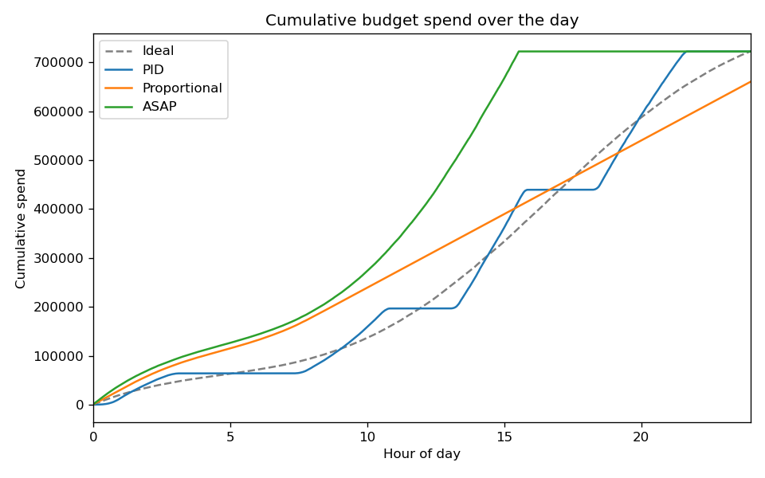

# Budget Pacing Report

This report compares three budget pacing controllers on one simulated diurnal traffic curve and one daily budget. The goal of a pacer is to spend the budget smoothly across the day so the campaign avoids early exhaustion, keeps cost per mille stable, and reaches users throughout the whole day.

Daily budget. 722101.6 spend units

## Metrics

Budget utilization is the share of the budget that was spent. Smoothness error is the normalized root mean squared error of the realized cumulative spend against the ideal traffic proportional spend, so lower is smoother. Exhaustion hour is when the campaign first spent almost all of its budget, so a later hour means the spend lasted across the day.

| Pacer | Budget utilization | Smoothness error | Exhaustion hour |
| --- | --- | --- | --- |
| PID | 1.0000 | 0.0401 | 21.65 |
| Proportional | 0.9137 | 0.0883 | 24.00 |
| ASAP | 1.0000 | 0.2358 | 15.53 |

## Cumulative Spend

The figure overlays the cumulative spend of each pacer against the ideal pacing line. A curve that hugs the ideal line spent in step with demand.

## Why Smooth Pacing Matters

The ASAP pacer wins every eligible impression until the budget is gone, so it exhausts the budget early and goes dark for the rest of the day. That concentrates spend in a narrow window, drives up cost per mille, and leaves most of the day uncovered. The proportional pacer targets a flat per slot spend and does better, but with no feedback it drifts when traffic is uneven. The PID pacer tracks the ideal trajectory with a feedback loop, so it corrects drift and lands closest to the smooth ideal spend curve.
