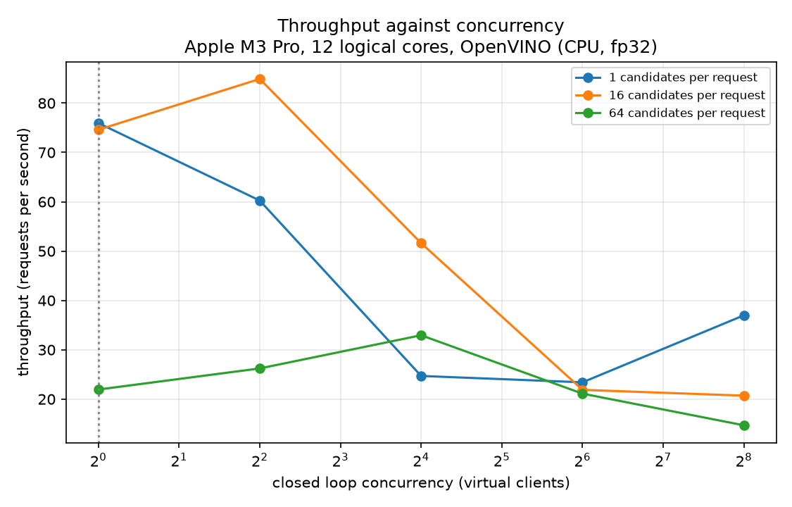
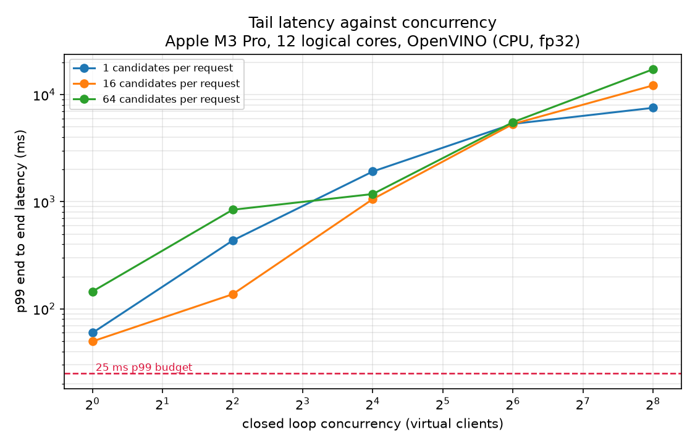
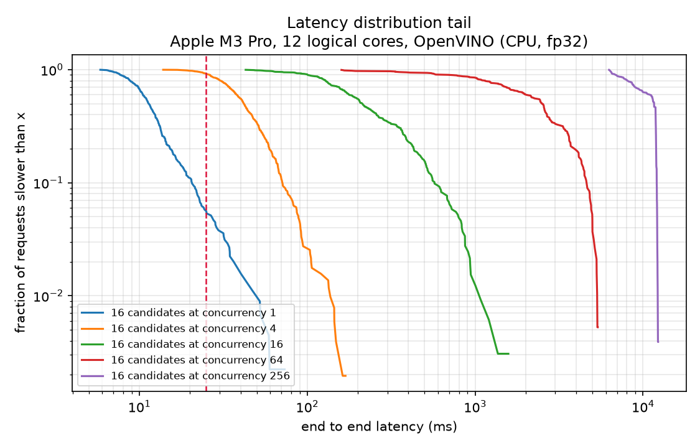

# Serving Load Test

Closed loop load test of the AdRankBench ranking service. Every number on this page was measured on the machine named below and applies to that machine, that backend, and that configuration only.

## Configuration

| Field | Value |
| --- | --- |
| Measured at (UTC) | 2026-08-28T01:43:05Z |
| Hardware | Apple M3 Pro, 12 logical cores, OpenVINO (CPU, fp32) |
| Logical cores | 12 |
| Backend | OpenVINO (CPU, fp32) |
| Model | DeepFM |
| Service thread pool | 8 |
| Service workers | 1 |
| Load generator | closed loop, asyncio and httpx |
| Warmup per cell | 2.0 s, discarded |
| Measured per cell | 6.0 s |
| p99 budget | 25 ms |
| Host load average at start | [63.81, 66.64, 61.76] |
| Run label | shared developer laptop, other workloads running concurrently |

**These numbers were taken on a busy host.** The one minute load average at the start of the sweep was 63.8 on 12 logical cores, which means other work was competing for the same cores as the service. Every latency on this page is inflated by that contention and should be read as an upper bound rather than as the service's own number. Rerun on an idle machine before quoting anything from it.

## Results

Latency is end to end at the client, so it includes json serialization, the loopback network, the queue inside the service, the feature pipeline, and the model call. Throughput is completed requests divided by the measured wall time of the cell. Ad scores per second multiplies that by the candidate set size, which is the number a capacity plan actually consumes.

| Candidates | Concurrency | RPS | Ad scores/s | p50 ms | p95 ms | p99 ms | p999 ms | Errors | Feature ms | Model ms | Host load |
| --- | --- | --- | --- | --- | --- | --- | --- | --- | --- | --- | --- |
| 1 | 1 | 76.0 | 76 | 9.77 | 28.72 | 59.70 | 105.01 | 0.0000 | 5.66 | 1.05 | 65.0 |
| 1 | 4 | 60.2 | 60 | 42.45 | 190.11 | 434.82 | 661.64 | 0.0000 | 12.82 | 6.45 | 69.3 |
| 1 | 16 | 24.7 | 25 | 499.46 | 1478.35 | 1919.09 | 2115.18 | 0.0000 | 9.44 | 31.07 | 70.5 |
| 1 | 64 | 23.4 | 23 | 2140.86 | 5172.42 | 5342.99 | 5376.16 | 0.0000 | 6.02 | 18.65 | 60.8 |
| 1 | 256 | 37.0 | 37 | 5631.76 | 7490.89 | 7542.99 | 7863.71 | 0.0027 | 5.83 | 38.25 | 64.2 |
| 16 | 1 | 74.6 | 1194 | 11.37 | 26.96 | 49.70 | 67.20 | 0.0000 | 5.89 | 0.95 | 67.0 |
| 16 | 4 | 84.9 | 1358 | 41.88 | 88.43 | 136.86 | 165.59 | 0.0000 | 6.64 | 6.07 | 71.9 |
| 16 | 16 | 51.6 | 826 | 213.00 | 795.19 | 1059.79 | 1507.83 | 0.0000 | 7.88 | 17.71 | 83.3 |
| 16 | 64 | 21.9 | 350 | 2518.61 | 4984.31 | 5327.53 | 5368.27 | 0.0000 | 6.53 | 20.34 | 92.4 |
| 16 | 256 | 20.7 | 331 | 11631.49 | 12128.70 | 12223.61 | 12285.49 | 0.0000 | 6.92 | 50.18 | 100.9 |
| 64 | 1 | 21.9 | 1404 | 36.11 | 103.84 | 145.42 | 154.99 | 0.0000 | 19.35 | 5.39 | 97.9 |
| 64 | 4 | 26.2 | 1678 | 119.45 | 267.08 | 842.66 | 847.65 | 0.0000 | 42.15 | 18.22 | 92.8 |
| 64 | 16 | 32.9 | 2108 | 386.39 | 1096.11 | 1181.61 | 1237.51 | 0.0000 | 38.27 | 62.57 | 94.8 |
| 64 | 64 | 21.1 | 1351 | 1780.92 | 5278.47 | 5543.56 | 5604.43 | 0.0000 | 15.09 | 55.73 | 95.6 |
| 64 | 256 | 14.7 | 940 | 13950.25 | 16548.23 | 17284.64 | 17362.84 | 0.0000 | 22.55 | 73.37 | 95.5 |

## Against the Budget

The budget is a p99 of 25 ms end to end for one auction. The derivation is in `docs/SERVING.md` and it is a slice of a roughly one hundred millisecond ad request, of which retrieval, the auction, and the network hops take the rest.

**No cell in this sweep held the p99 under the budget. The closest was 49.7 ms at concurrency 1 with 16 candidates.**

## The Knee

The knee is the concurrency past which p99 climbs faster than throughput improves. It is the operating point a capacity plan is built on, because beyond it extra load buys queue depth rather than work.

| Candidates | Knee concurrency | Reading |
| --- | --- | --- |
| 1 | 1 | past 1 concurrent clients the p99 grows faster than the throughput does, so additional load buys queue depth rather than work |
| 16 | 1 | past 1 concurrent clients the p99 grows faster than the throughput does, so additional load buys queue depth rather than work |
| 64 | 1 | past 1 concurrent clients the p99 grows faster than the throughput does, so additional load buys queue depth rather than work |

Step by step, where efficiency is the throughput gain divided by the p99 cost.

| Candidates | Step | Throughput gain | p99 cost | Efficiency |
| --- | --- | --- | --- | --- |
| 1 | 1 to 4 | 0.79x | 7.28x | 0.11 |
| 1 | 4 to 16 | 0.41x | 4.41x | 0.09 |
| 1 | 16 to 64 | 0.95x | 2.78x | 0.34 |
| 1 | 64 to 256 | 1.58x | 1.41x | 1.12 |
| 16 | 1 to 4 | 1.14x | 2.75x | 0.41 |
| 16 | 4 to 16 | 0.61x | 7.74x | 0.08 |
| 16 | 16 to 64 | 0.42x | 5.03x | 0.08 |
| 16 | 64 to 256 | 0.95x | 2.29x | 0.41 |
| 64 | 1 to 4 | 1.20x | 5.79x | 0.21 |
| 64 | 4 to 16 | 1.26x | 1.40x | 0.90 |
| 64 | 16 to 64 | 0.64x | 4.69x | 0.14 |
| 64 | 64 to 256 | 0.70x | 3.12x | 0.22 |

## How to Read These Numbers

This is a closed loop test. A fixed number of virtual clients each wait for a response before sending the next request, so the offered load is a consequence of the service's speed rather than an independent variable. An open loop test, which fires at a fixed rate whatever the service is doing, would report a worse tail from the same service. The two are not interchangeable and this page is the first kind.

Because of that, these tails are a floor rather than an estimate. A slow response suppresses the requests a client would otherwise have sent during it, and the suppressed requests are precisely the ones that would have been slowest. That is coordinated omission. It is not corrected here, it is stated, and the achieved concurrency column in the json exists so a cell where the clients rather than the service were the bottleneck can be spotted.

The feature and model columns are server side means reported by the service itself, and they are the reason the end to end number is what it is. They do not sum to the end to end latency, because the difference between them is queueing, json handling, and the loopback hop.

Every cell ran for a fixed wall time rather than a fixed request count, so a slow cell and a fast cell both get the same amount of clock and the percentiles of the fast cell rest on more samples rather than on a longer window.

## Charts

