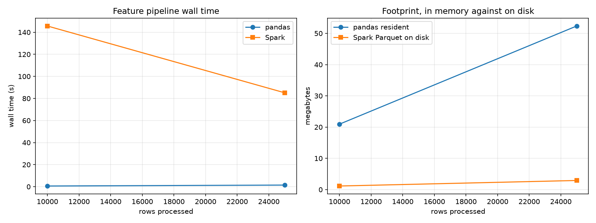

# Spark Feature Pipeline Report

Every number below was measured on the machine named here, on the row counts named here, and nowhere else.

- Hardware. Darwin arm64, 12 logical cores, Python 3.12.7
- Machine state at write time. one minute load average 77.5 against 12 cores, contended.
- Spark master. `local[4]`
- Shuffle partitions. 16
- Driver memory. 4g
- Session startup. 9.80 s, paid once per run.

If the machine state above says contended, every wall time in this report is an upper bound and the throughput numbers are a lower bound. Rerun on a quiet machine before quoting any of them.

## Scaling

Both pipelines ran over the same frame at each row count. The pandas resident column is the exact live footprint of that path, which is the deep memory of the raw frame plus the bytes of the three featurized Datasets, all of which are held at once. The Spark column is the size of the Parquet output on disk, because the Spark path never has to hold the featurized data in memory at all.

| Rows | pandas s | Spark s | Speedup | pandas rows/s | Spark rows/s | pandas resident | Spark Parquet |
| --- | --- | --- | --- | --- | --- | --- | --- |
| 10000 | 0.62 | 145.67 | 0.00x | 16199 | 69 | 20.0 MB | 1.1 MB |
| 25000 | 1.47 | 85.15 | 0.02x | 17044 | 294 | 49.9 MB | 2.8 MB |

pandas stayed faster across every row count measured, so no crossover was observed inside this range. Extrapolating one would not be a measurement.

